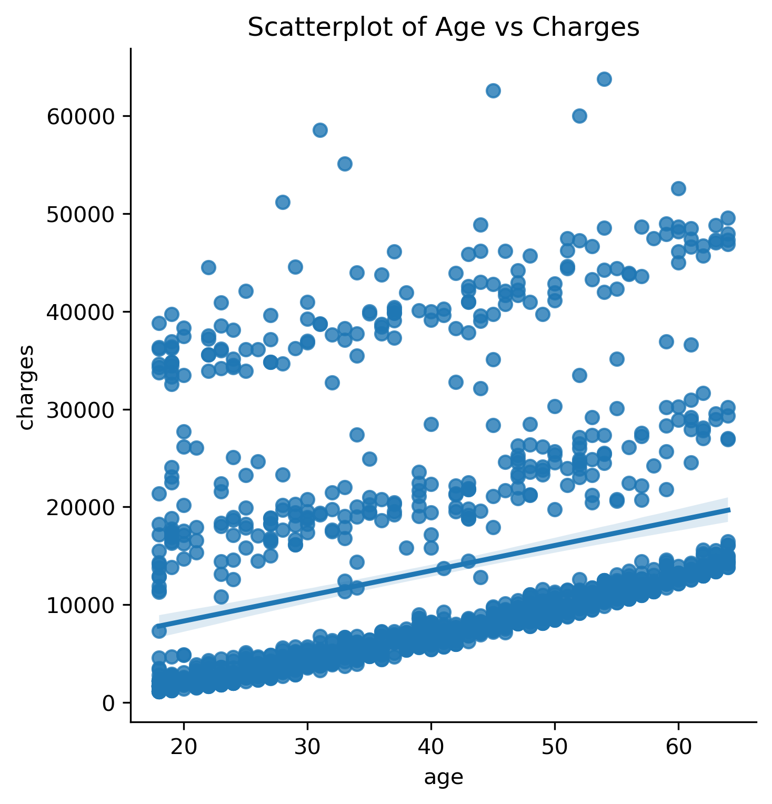

# insurance-costs-analysis
This project explores the "U.S. Medical Insurance dataset" to understand which factors influence individual insurance pricing. The analysis includes data exploration, visualization, and a multiple linear regression model using `statsmodels`.

---

## 📊 Dataset
The dataset contains **1,338 observations** with the following variables:
- `age`: Age of the individual
- `sex`: Male / Female
- `bmi`: Body mass index
- `children`: Number of children/dependents
- `smoker`: Yes / No
- `region`: Residential region in the U.S.
- `charges`: Medical costs billed

---

## 🔎 Exploratory Data Analysis
Example visualization:  

- Higher **BMI** is associated with higher medical charges.
- Smokers clearly have **much higher charges** compared to non-smokers.

---

## 📈 Regression Model
I built a **multiple linear regression model** including all variables (categorical variables converted to dummies).

**Key results:**
- **R² = 0.75** → The model explains about 75% of the variance in medical charges.  
- **Statistically significant predictors:**
  - `age`: Older individuals tend to have higher charges.
  - `bmi`: Higher BMI is linked to higher charges.
  - `children`: More children slightly increases charges.
  - `smoker`: Smoking has the largest effect, increasing charges by ~23,850 USD on average.
  - Some regional differences also appear significant.
- **Not significant:** Sex (male/female) does not have a meaningful effect.

---

## 🛠 Tools & Libraries
- Python (`pandas`, `os`, `matplotlib`, `seaborn`, `statsmodels`)
- Jupyter Notebook

---

## 📌 Key Learnings
- How to prepare categorical data using dummy variables.
- Building and interpreting linear regression models with `statsmodels`.
- Identifying which features are statistically significant in predicting outcomes.

---

## 🚀 Next Steps
- Try **regularization techniques** (Lasso, Ridge) to improve model robustness.
- Explore **interaction effects** (e.g., smoking × BMI).
- Deploy the notebook as an interactive dashboard (e.g., Streamlit).

---
