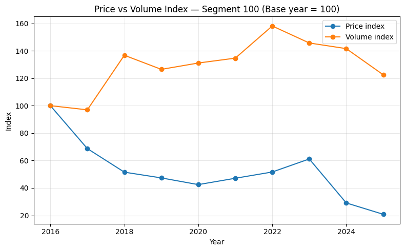
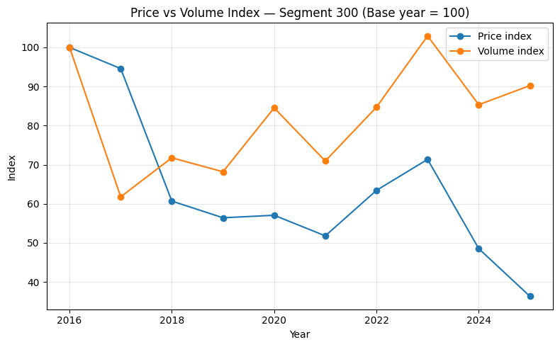

# Kongsberg Maritime /AtlantMar Pricing & FX Exposure Analysis

A business-oriented analytics project focused on pricing performance, revenue concentration, foreign exchange exposure, and strategic commercial risk analysis within a global maritime company environment.

This project was developed as part of a Pricing & Business Analyst case study done for Kongsberg Maritime inspired by real-world business challenges in the maritime industry. In this case, the fictional maritime company is AtlantMar. The goal was not only to analyze historical data, but also to translate complex operational and financial information into actionable business insights and strategic recommendations.

The project combines:
- Python-based data analysis
- SQL querying with DuckDB
- Business intelligence workflows
- Financial and commercial analysis
- Executive-level data storytelling
- Power BI visual exploration

---

# Project Overview

AtlantMar operates internationally with significant exposure to foreign currencies and highly concentrated revenue streams. The analysis focused on understanding:

- Revenue distribution across product segments
- Pricing realization and discounting behavior
- Revenue growth drivers (price vs volume)
- Foreign exchange exposure
- Natural hedging opportunities
- FX sensitivity and commercial risk

The final deliverable was structured as an executive-style business presentation supported by analytical workflows and Power BI exploration dashboards.

---

# Key Business Questions

The project explored several strategic and commercial questions:

- Which product segments drive the majority of revenue?
- Is revenue growth driven by pricing power or increased sales volume?
- How consistent is pricing realization across segments?
- How exposed is the company to USD and EUR fluctuations?
- Does the procurement structure provide any natural FX hedge?
- What commercial risks could impact future profitability?

---

# Key Insights

- Revenue was highly concentrated in two primary product segments, increasing dependency on a small portion of the business.
- Revenue growth in the largest segments was primarily volume-driven, while average prices declined over time, suggesting reduced pricing power.
- Approximately 75% of revenue originated from foreign currencies, with USD representing the largest exposure.
- Procurement costs were largely NOK-denominated, creating limited natural hedging and increasing sensitivity to USD/NOK fluctuations.
- FX sensitivity analysis showed that exchange-rate movements could materially impact reported revenue and profitability.

---

## Example Visualizations

### Revenue Growth: Price vs Volume Dynamics

This visualizations compare price and volume development across AtlantMar’s two largest product segments between 2016 and 2025. The analysis showed that revenue growth was primarily driven by increased sales volumes while average prices declined over time.

---

# Technical Workflow

## Data Processing & Analysis

The analytical workflow was built using:

- Python
- Pandas
- DuckDB
- SQL
- Jupyter Notebook / Anaconda environment

DuckDB was used as the analytical SQL engine to query and process large transactional datasets efficiently directly within the Python workflow.

The project included:
- Data cleaning and validation
- Currency conversion logic
- SQL-based aggregations and joins
- Pricing and revenue calculations
- FX exposure analysis
- Scenario modeling
- Trend analysis

---

# 📊 Data Sources

The analysis combined multiple operational and financial datasets in a SQL database, including:

- `customer_invoices`
- `vendor_invoices`
- `gl_transactions`

The data covered:
- Global sales transactions
- Procurement transactions
- Revenue and cost postings
- Multiple currencies
- Historical data from 2016–2025

The datasets were analyzed at invoice-level granularity to enable detailed pricing and volume analysis.

---

# Analytical Areas

## Revenue Concentration Analysis

The analysis identified a strong concentration of revenue within two primary product segments, creating significant commercial dependency and concentration risk.

## Pricing Realization Analysis

Pricing realization was evaluated across segments to identify discounting patterns, pricing consistency, and potential margin improvement opportunities. One segment showed significantly lower realization levels than the rest, indicating possible pricing inefficiencies.

## Price vs Volume Dynamics

Historical trend analysis showed that revenue growth was primarily volume-driven rather than price-driven, suggesting declining pricing power over time in the core business segments.

## FX Exposure Analysis

The project evaluated the company’s exposure to foreign currencies and identified USD as the dominant revenue exposure. Approximately 75% of revenue originated from foreign currencies, creating substantial sensitivity to FX fluctuations.{index=5}

## Natural Hedge Assessment

Procurement costs were heavily NOK-denominated, while revenue was primarily generated in USD and EUR. This created limited natural hedging and increased profitability sensitivity to exchange-rate movements.

## FX Sensitivity Modeling

Scenario analysis was used to estimate the impact of USD/NOK exchange-rate movements on reported revenue and commercial performance.

---

# Power BI Exploration

In addition to the Python and SQL analysis workflow, the processed data was connected to Power BI to support interactive business exploration and stakeholder-oriented visualization.

The dashboards explored:
- Revenue trends over time
- Revenue by currency
- Revenue concentration by segment
- Currency exposure
- Average invoice value by currency

The Power BI layer was used to support exploratory analysis and strengthen executive storytelling.

---

# Strategic Recommendations

Based on the analysis, the project proposed several business-oriented recommendations:

- Strengthen pricing discipline in high-volume segments
- Improve discount governance and price realization
- Monitor concentration risk in core revenue segments
- Reduce FX exposure through hedging strategies
- Align procurement currency more closely with revenue currencies where possible

---

# 🛠 Tools, Libraries & Skills used

## Technical Skills
- Python (`pandas`, `matplotlib`, `seaborn`, `numpy`)
- SQL (`window functions`, `aggregations`, `joins`, `CTEs`, `DuckDB SQL`)
- DuckDB
- Pandas
- Data Cleaning
- Data Modeling
- Power BI
- Data Visualization

## Analytical Skills
- Pricing analysis
- Revenue analysis
- FX exposure analysis
- Trend analysis
- Scenario modeling
- Strategic business analysis
- Financial interpretation

## Business Skills
- Executive-level communication
- Data storytelling
- Stakeholder-oriented reporting
- Commercial reasoning
- Translating data into actionable recommendations

---

# 📌 Key Learnings

This project strengthened my ability to combine technical analytics with business-oriented thinking and strategic communication.

Beyond the technical implementation, the project focused heavily on translating complex commercial and financial data into insights that could support real business decisions related to pricing strategy, profitability, and risk exposure.