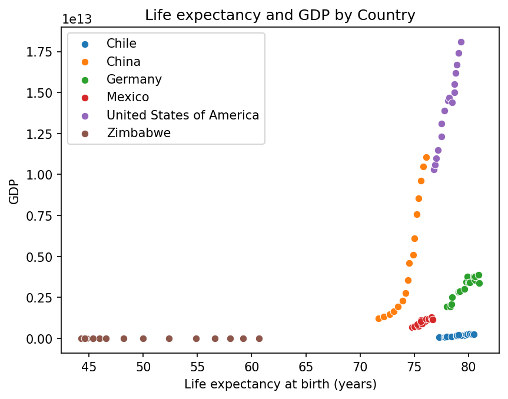
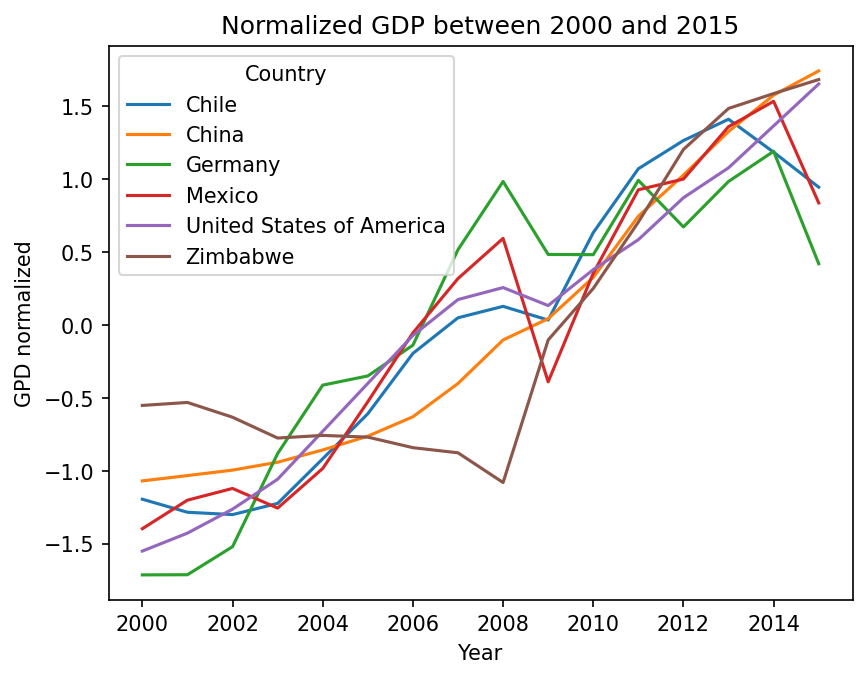

# Life Expectancy and GDP
This project explores the relationship between GDP and life expectancy across six countries between 2000 and 2015, using data from the **World Bank / World Health Organization**.
The analysis focuses on exploratory visualization, correlation analysis, and country-level trend comparisons.

---

## 📊 Dataset
The dataset contains annual observations for the following countries:
- Chile
- China
- Germany
- Mexico
- United States
- Zimbabwe

Variables:
- `Country`: Name of the country for each observation.
- `Year`: Observation year (2000–2015).
- `Life expectancy at birth (years)`: Average number of years a newborn is expected to live, based on current mortality rates.
- `GDP`: Gross Domestic Product (in current USD) of each country for the given year.

---

## 🔎 Exploratory Data Analysis
Example visualization:  

**Key observations:**
- Globally, GDP and life expectancy show only a moderate positive correlation.
- When analyzed at country level, we see strong positive relationships in every country.
- Zimbabwe stands out as an outlier with low GDP and highly volatile life expectancy values.
- The United States and China display the strongest GDP expansion over time, while Germany shows stable growth with consistently high life expectancy.

---

## 📈 Correlation & Statistical Analysis

**Global correlation**
A **Pearson correlation test** across all data points:
**r = 0.34
p < 0.001**
This indicates a statistically significant but weak global relationship between GDP and life expectancy.

**Country-level correlations**
Within each individual country, correlations were much stronger:
- Chile: 0.95
- China: 0.91
- Germany: 0.93
- Mexico: 0.93
- United States: 0.98
- Zimbabwe: 0.97

**Key observations:**
Economic growth within countries is strongly linked to improvements in life expectancy, but these strong relationships are hidden when countries are aggregated together. This is an example of how summary statistics can obscure local patterns.

---

## 📉 Trend Normalization

To compare growth patterns across economies of very different scales, GDP values were normalized per country using z-score standardization.

**Key observations:**
- China shows the strongest relative growth over the entire period.
- The United States demonstrates steady, stable long-term expansion.
- Chile and Mexico follow consistent growth trajectories.
- Germany displays moderate growth with early volatility.
- Zimbabwe shows extreme GDP instability, reinforcing its classification as an economic outlier.

---

## 📌 Key Learnings & Conclusion
- How aggregation can dilute meaningful relationships between variables.
- The importance of segmenting data for accurate interpretation.
- Using correlation analysis and hypothesis testing to evaluate statistical significance.
- Applying z-score normalization to compare trends between unequal economies.
- Creating clear visual narratives using `Seaborn` and `Matplotlib`.

While global analysis shows only weak correlation between GDP and life expectancy, a country-level analysis reveals strong relationships between the countries.
The project demonstrates how segmented analysis and normalization techniques uncover meaningful socioeconomic insights that aggregated data can obscure.

---

## 🛠 Tools & Libraries
- Python (`pandas`, `numpy`, `matplotlib`, `seaborn`, `scipy`)
- Jupyter Notebook

---
